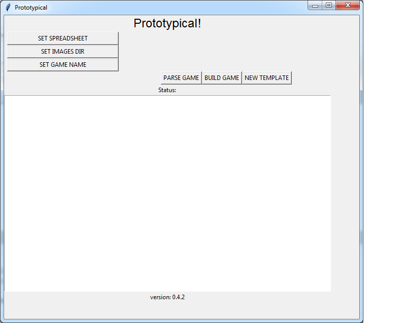

# Prototypical v0.1

## What does it do?

Prototypical allows rapid prototyping of board games by means of reading a spreadsheet and then converting it to a custom Tabletop Simulator save file.

You can design, build and test a game in minutes. Changes to content can be completed in seconds.

## What does it not do?

Since this is a prototyping tool, all generated content is rough and you have limited control over aesthetic aspects.

Do not expect any production-quality assets to come out of it. It is designed for play-testing **only**.

Currently, files are stored on your disk only. This means you cannot (yet) share your prototypes with other players.

## Author

This software was originally written by Erik Roelofs (erik@ruigekonijnen.nl)

## Requirements

Prototypical is designed to work on any Operating System. You must have Python 3 installed to run it.

Exectables might be made available, in which case they only work on whatever OS they were built for.

You will need to obtain a copy of Tabletop Simulator from [Berserk Games](http://berserk-games.com/buy/) if you want to do anything useful with this application.

## Basic usage

After launching the program, you will see the interface:

You can click "NEW TEMPLATE" to generate a new template. Place it anywhere you like, then click "SET SPREADSHEET" to select it for building.

Use "SET SAVE DIR" to select a directory to hold the generated save file. (This will usually be your saves folder for Tabletop Simulator, which is located in your documents directory under "My Games\Tabletop Simulator\Saves" )

Use "SET IMAGES DIR" to select a directory that will hold the generated images. This can be any directory you like.

Use "SET GAME NAME" to set a name for the game. This will be visible inside Tabletop Simulator.

Once your spreadsheet is filled with game components, click "BUILD GAME" to start the build process. If it completes succesfully, open up Tabletop Simulator, and your game should be available under Load/Save.

If any errors happens, fix your spreadsheet, then try building again.

## Bugs, feedback?

If you find any bugs, or have any feedback you want to share, you can drop me an email at prototypical@ruigekonijnen.nl

## Quick note about rebuilding & reloading your game:

Due to the way Tabletop Simulator works, if you rebuild a game while TTS is still open, you will not see any changes to custom content.

In order to see your updated cards, boards, etc, you will need to click "Clear table" from the Game menu, then reload the game.

A normal reload will just reuse the old files, which are still in TTS memory.