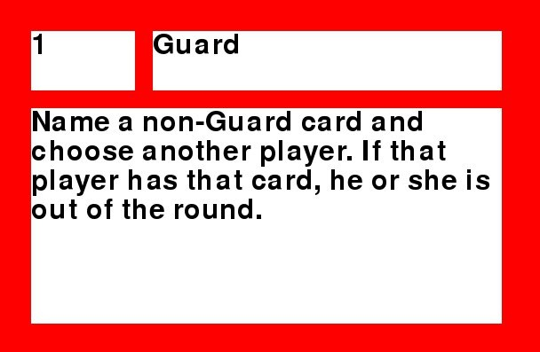

# Reference

This is the full reference for all the sheets, columns and options in the spreadsheet.
If you need to know what options are allowed or available, this is where you go!

## Complex types

Complex Types describe complicated custom content used by your game. Currently, it supports cards and boards.

Complex Objects allow multiple pieces of content to be written to a custom element, but they need a Type to hold the main information.

### NAME
This is the name of the object, which is used when referencing it on other sheets.

*Names should be unique across all entities!*
### SIZE
Describes how big the object should be in game. Formatted as width times height: '400x600'

For an idea of sizes, 400x600 is about normal playing card format within TTS. 1500x1500 is a mid sized playing board, 3000x3000 is a big one.

Try a few sizes to see what works for your part.

### SHAPE-TOPLEFT & SHAPE-BOTTOMRIGHT
These reference cells on the Shapes sheet. They define how content is placed into the Complex Object at build time.

Formatted as a normal cell reference: 'A1'

For more information, see "Shapes", below.

### BG-COLOR

This references a color, which will be used to fill in the front of the card that is not used for content, and the lines between areas.

It is either a written name of a color, or a color hex-code: 'red' or '#ff0000'*.

To see (or modify) the list of supported colors, look at "colors.xls" in the data folder.

(Note that if you modify it and then send your game-sheet to someone else, they will not be able to build it!)

### BACKSIDE

This references a color, like above. It will be used to fill in the backside of the card.

The back of a card is always a single color at this time.

### TYPE

This can be either 'card' or 'board'.

If set to 'card', it will be rendered into the simulator as a playing card. Cards can only be added to the simulator as part of a deck.

If set to 'board', it will be rendered into the simulator as a board. Boards can be placed directly.

## Shapes

Shapes represent what content belongs where on a complex type such as a card or board. This sheet is different from the others in that it has no columns.

Shapes are simply areas that have letters filled in. Each letter references the column on the Complex Object sheet that the content is pulled from.

For example, if your area contain the letter 'c', then that part of the card will contain the content in the 'c' column of the Complex Object.

Under Complex Type, a topleft and bottomright corner for a shape are selected. Using the same letter multiple types will pull all these parts of the shape together into one drawing area.

For example, if you have a shape like this:

>cddd

>eeee

>eeee

Then when drawing the item, the top left of the corner will show whatever is in the 'c' column for this Complex Object.  The rest of the top line will contain the 'd' column. And then below that, the entire card will be filled with the content of the 'e' column.

In a game, this shape might for example become a card like this:

Shapes can be any size and contain any number of content elements. Make sure to **not** use the 'a' and 'b', as these are used for the name and type and will not be rendered.

You can also use the zero for parts of the card that should contain no content. These will just be in the background color.

## Complex Objects

Representing the last part of the Complex Object setup, these are specific instances of a complex custom object.

Where a complex type might represent "a magic spell" and a shape might represent "the layout of a spell card", a Complex Object would represent "Fireball", a specific element in your game.

### NAME

This is the name of the complex object. You can use whatever you want, and reference the object in other sheets by this name.

*Names should be unique across all sheets.*

### TYPE

This is the Complex Type used to render this object. It should contain the name of the Complex Type.

### CONTENT?

Any content needed for the Complex Type. Each column name references a letter in the shape, so if the shape contains 'c' in the top left corner, then on this sheet you should put whatever you want in the top left of the card in the 'c' column.

## Decks

Decks are collection of cards. In order to place cards in the simulator, you need to collect them into decks. A deck might have multiple copies of the same card in it.

To start a new deck, put the word 'Deck' in the first cell of a row. Then put the name of the deck in the next column.

It should look like this:

> Deck  MyDeckName

Below that, the first column of each row should reference the *name* of a Complex Object. The second column of the row should be the number of types that card must appear in the deck.

You can keep repeating card names and counts and everything will go in the same deck, until the first column contains the word 'Deck' again, which signals a new deck.

## Tokens

Tokens represent the various, simpler, parts of your game. This may include colored cubes, pawns, triangles, but also custom tokens with text or numbers on them.

### NAME
The name of this token type.  You can use whatever you want, and reference the object in other sheets by this name.

*Names should be unique across all sheets.*

### ENTITY
Determines the type of entity that is used. Can be one of these values:

 - Cube (will produce a small, single color cube)
 - Triangle (will produce a small, single color triangle)
 - Pawn (will produce a small, single color pawn)
 - Token  (will produce a small rectangle with some content printed on both sides)

### COLOR
This references a color, which will determine the color of a simple token, or the background color of a custom token.

It is either a written name of a color, or a color hex-code: 'red' or '#ff0000'*.

To see (or modify) the list of supported colors, look at "colors.xls" in the data folder.

(Note that if you modify it and then send your game-sheet to someone else, they will not be able to build it!)

### SIZE
This is the size of the token. Note that the "Token" option ignores this; a custom token is always just big enough to hold the content.

For everything else, larger numbers are larger tokens. A size of 1 is the normal size; the number can be floating point.

### TEXT-COLOR-FRONT

Only used when the "Token" entity option is chosen. This sets the color of the text used.

(See "Color" above, for more on colors)

### CONTENT-FRONT

Only used when the "Token" entity option is chosen. This determine the content written on the token.

(The backside will have the same information; mirrored)

## Dice

These represent various dice used by your game. You can set their color, size and number of sides (from the common dice types)

If you are using a 6-sided die, you can also use custom content on them.

### NAME
The name of this die type.  You can use whatever you want, and reference the object in other sheets by this name.

*Names should be unique across all sheets.*

### COLOR
This references a color, which will determine the color of the die.

It is either a written name of a color, or a color hex-code: 'red' or '#ff0000'*.

To see (or modify) the list of supported colors, look at "colors.xls" in the data folder.

(Note that if you modify it and then send your game-sheet to someone else, they will not be able to build it!)

### SIZE
This is the size of the die.

Larger numbers are larger dice. A size of 1 is the normal size; the number can be floating point.

### SIDES

The number of sides for this die. This must be one of 4, 6, 8, 10, 12 or 20.

If you use anything other than 6, the Content? columns should be empty.

### CONTENT?

When using a 6-sided die, you can fill the next 6 columns with whatever custom things you want on your dice.

You can either use 1 or 2 numbers or characters, which will be written in large font, or up to about 10 characters of smaller text.

You can leave columns empty to leave blanks on the die, except the first one (which is used to determine that this die needs custom content.)

## Placement

This final tab decides what goes where. It shows a large square, 15 by 15 cells wide (with a border to show the size of the board)

Each cell represents a 1/15th by 1/15th chunk of the final playing table. To put things on the table, simply write the name(s) of the items where you want them put.

If you want to place multiple different items, seperate them with a semicolon: 'Card;Pawn'

If you want to place multiple of the same item, prepend the name of the item with a number and an x: '15xPawn'

(You can add spaces if you like)

Note that items are placed with their *center* somewhere in the shown area. Really large items will spill over into adjacent areas.

Also, Prototypical doesn't know how big things are, so it randomly distributes them around the cell.

Usually this isn't a problem, but occasionally two items will intersect and bounce off the table when you load the game. In this case, rebuilding is usually enough to fix it. If it's a common occurence, pack the cells less densely.
